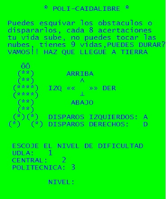

# 🎮 Policaidalibre



**Policaidalibre** is a classic-style game developed in C where your mission is simple: **help a skydiver land safely** by **dodging clouds and obstacles** on the way down. The game challenges players across **three difficulty levels** while managing limited lives and aiming for the ground. Can you survive the fall?

---

## 🕹️ Gameplay

- You're a man parachuting towards the **ground**.
- **Avoid clouds and obstacles** as you descend.
- Every **8 successful dodges**, you **recover 1 life**.
- You start with **9 lives**.
- The goal is to reach the **ground** safely!


### Difficulty Levels

- **Fácil (Easy):** Udla  
- **Medio (Medium):** Central  
- **Difícil (Hard):** Politécnica  

Each level increases the difficulty, speed, and complexity of the obstacles.

---

## ⚙️ Installation

To compile and play the game, run the following in your terminal (due to the imported libraries, this game is compatible with Windows, you can change the imported libraries to become compatible with Linux). First, you need to install a C Compiler in your Windows machine (GCC).

```bash
gcc PolicaidalibrexD.c -o game
./game.exe
```

Make sure you have `gcc` installed.

---

## Technical Info

- Language: **C**
- The game is implemented using **structures** (`structs`) for organizing game entities.
- The code is written in a **procedural** style with clear separation of game logic and rendering.

---

## Author

- **Danilo Erazo**
- Creation date: **2015**

---

## License

This project is open-source and free to use for educational and non-commercial purposes.
